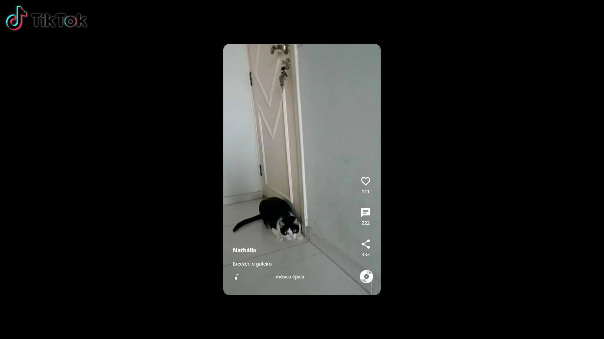
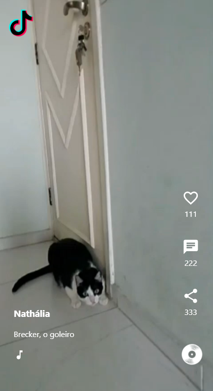

# Projeto - Tik Tok Clone




## Tabela de conteúdos

- [Sobre o projeto](#-sobre-o-projeto)
- [Tecnologias](#-tecnologias)
  - [WebSite](#website)
  - [Utilitários](#utilitarios)
- [Layout](#-layout)
  - [Mobile](#mobile)
  - [Web](#web)
- [Como executar o projeto](#-como-executar-o-projeto)
  - [Pré-requisitos](#pré-requisitos)
  - [Rodando a aplicação web](#user-content--rodando-a-aplicação-web)
- [Autor](#-autor)
- [Licença](#user-content--licença)

## 💻 Sobre o projeto

Projeto desenvolvido durante a Jornada Dev da EBAC entre os dias 28/03 e 04/04, onde recriamos o front-end do Tik Tok utilizando as tecnologias mais utilizadas no mercado.

Nele, vemos dois vídeos que podemos dar pley / pause ao clicar nele. Exibe as informações estáticas de compartilhamento, comentários e likes.

Também foi realizado alguns efeitos de animação via CSS e JS para parecer mais realista.

## 🛠 Tecnologias

As seguintes ferramentas foram usadas na construção do projeto:

#### **Website**

- **[React](https://reactjs.org/)**
- **[Firebase](https://reactjs.org/)**

#### **Utilitários**

- Editor: **[Visual Studio Code](https://code.visualstudio.com/)** → Extensions: **[Dotenv Official](https://marketplace.visualstudio.com/items?itemName=dotenv.dotenv-vscode)**
- Ícones: **[Material Icons](https://mui.com/material-ui/material-icons/)**

## 🎨 Layout

### Mobile



### Web


## 🚀 Como executar o projeto

### **Pré-requisitos**
Antes de começar, você vai precisar ter instalado em sua máquina as seguintes ferramentas:
- [Git](https://git-scm.com)
- [Node.js](https://nodejs.org/en/).
- [VSCode](https://code.visualstudio.com/)

#### **Rodando a aplicação web**

```bash
# Clone este repositório (HTTPS):
$ git clone https://github.com/nathaliaveneziano/ebac-titok-clone.git

# Clone este repositório (SSH):
$ git clone git@github.com:nathaliaveneziano/ebac-titok-clone.git

 # Acesse a pasta do projeto no terminal:
$ cd ebac-titok-clone

# Instale as dependências
$ npm install

# Execute a aplicação em modo de desenvolvimento
$ npm run start
```
OBS.: A aplicação será aberta na porta:3000 - acesse http://localhost:3000

---

## 🦸 Autor


<br />
Nathália Veneziano
<br />

[](https://www.facebook.com/nathalia.veneziano.developer)
[](https://www.instagram.com/nathalia.veneziano.developer/)
[](https://www.linkedin.com/in/nathalia-veneziano)
[](https://twitter.com/nath_veneziano)

---

## 📝 Licença

Este projeto esta sobe a licença [MIT](./LICENSE).

Feito com ❤️ por Nathália Veneziano 👋🏽 [Entre em contato!](https://www.linkedin.com/in/nathalia-veneziano)
